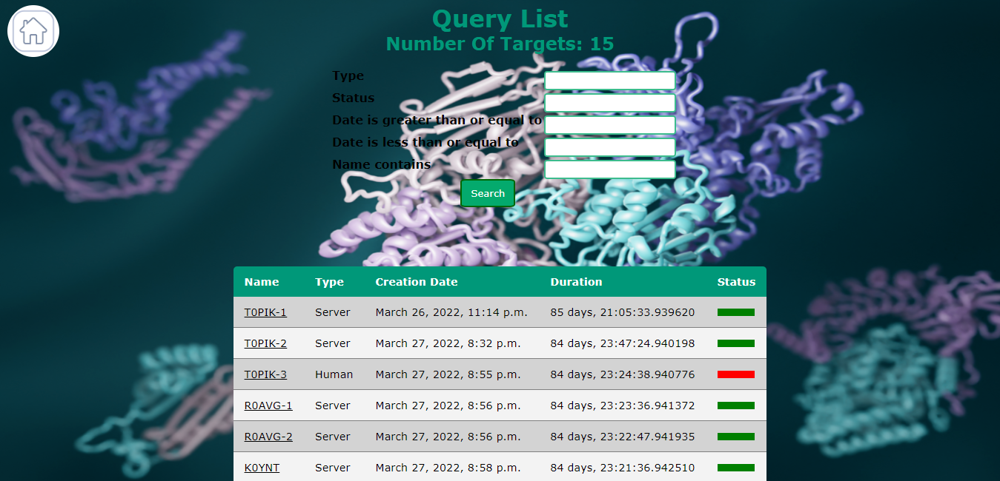
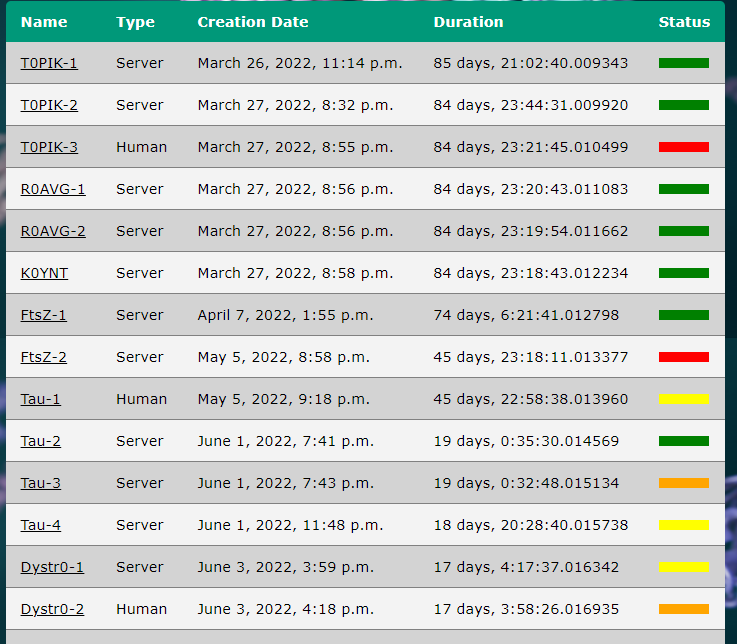
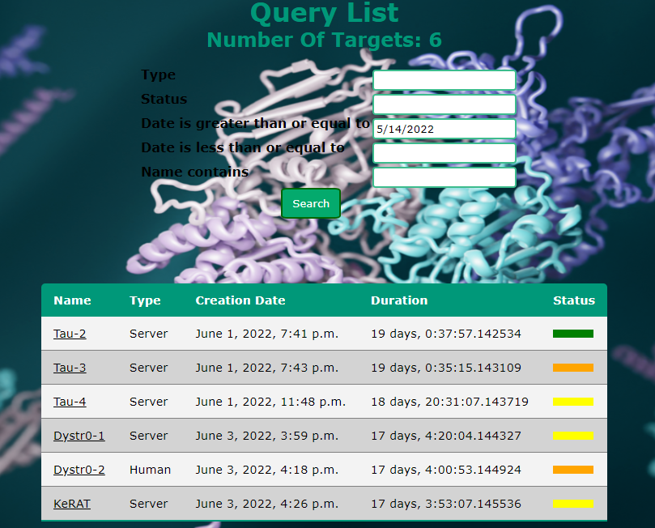
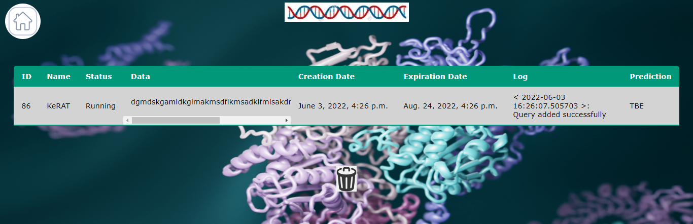

# Meshi Website Graduation Project - User Manual
## Table of Contents
1. [Introduction](#introduction)
2. [Reference](#reference)
   - [About](#about)
   - [Homepage](#homepage)
   - [Query List](#query-list)
     - [Filter](#filter)
     - [Return to Homepage](#return-to-homepage)
     - [View Query Details](#view-query-details)
   - [Query Details](#query-details)
     - [Delete Query](#delete-query)
     - [Return to List](#return-to-list)
4. [Training](#training)

## Introduction
We've designed our system to be used by participants of The Critical Assessment of protein Structure Prediction (CASP) competition.
Through a designated web application and a distributed network of computers that manages a pipeline prediction automation and communicates with the website,
we offer users the ability to track the progress of their protein predictions and manage them comfortably.
## Reference
### About
The about page displays some info regarding CASP15.

### Admin Page
The admin page allows the admins of the system to manage its database, more specifically, its queries.

You may add, remove and edit queries in addition to managing the other admins.

### Homepage
The homepage features a simplistic menu that has 3 buttons.

### Query List
The query list page displays all queries that are in the system and their information.

Here you can view their name, type, creation date, duration since created and status.
| Status | Meaning                    |
| ------ | -------------------------- |
| Red    | Past expiration date       |
| Orange | Failed and not yet expired |
| Yellow | In progress                |
| Green  | Done                       |

#### _Filter_
You can filter the queries by their fields. 
Once you've entered the appropriate filter value, press the *Search* button to display the new data.

For exmaple, using the following query list (containing 15 queries):

Let's filter it by displaying only the queries that were received from 14/5/2022, with the help of this filter
And this is the resulting list:

#### _Return to Homepage_
You can press the home button in the top-left corner to return to the homepage.

#### _View Query Details_
To view more elaborate details about a certain query, you can click on one from the list.

This will take you to the query details page.

### Query Details
Here you can view more details about a certain query such as its data, logs, prediction (if present) and more.

#### _Delete Query_
You can press the trash can icon to delete the current query from the list.

#### _Return to List_
You can press the DNA strand icon to return to the query list page.

## Training 
